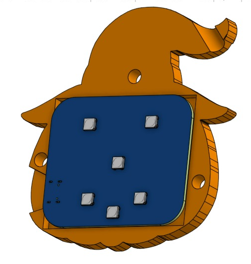

# CAD:
This Project consits of two 3d Printed parts which are designed in OnShape.  
Open-source design is available on [⚡ SPECTR ⚡](https://grabcad.com/library/spectr-1)  

## Features :
- Holds all parts in place.
- Improves Build Quality.
- Improves Looks and usability.
- Easy to Assemble and use.

## Images :

Top :  

Bottom :  

