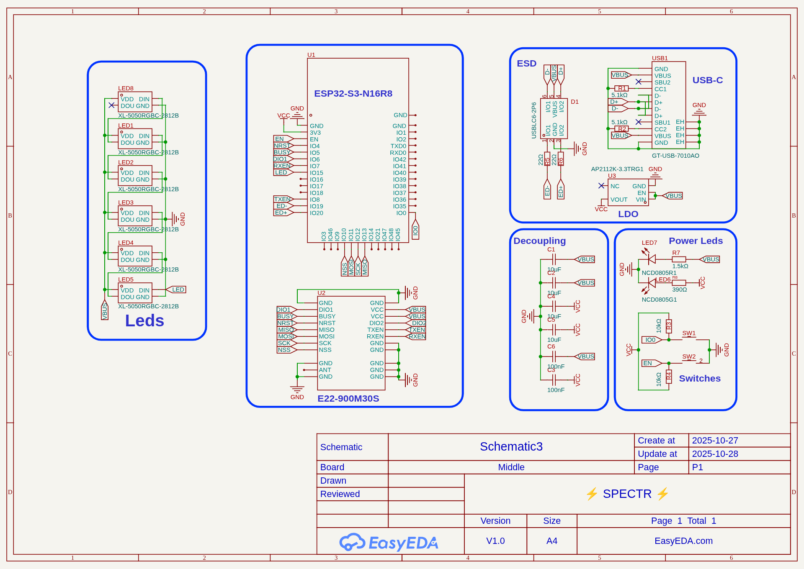
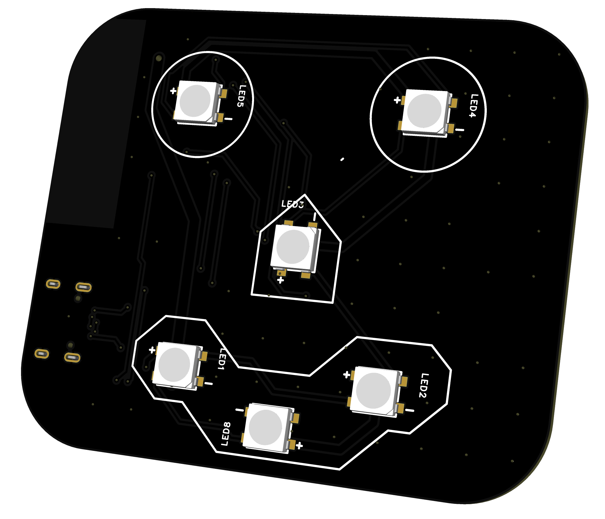
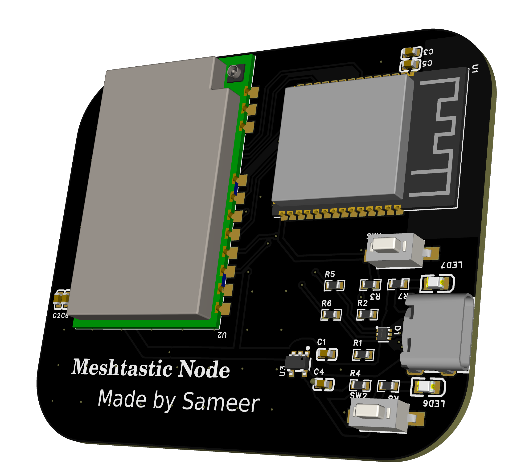

# PCB :

This project consists of 2 pcbs which are hold in place with the help of a 3d printed Chasis.  

The PCB design is open source and available on
[⚡ SPECTR ⚡](https://oshwlab.com/sameerkulhari2439/spectr)

## Main PCB
This pcb holds all the core electronics components required for the core functionlity of project.

Schematic :

Top :

Bottom :

## Secondary PCB
This PCB is for artistic purpose only and makes the project itself a piece of art.

Image :
