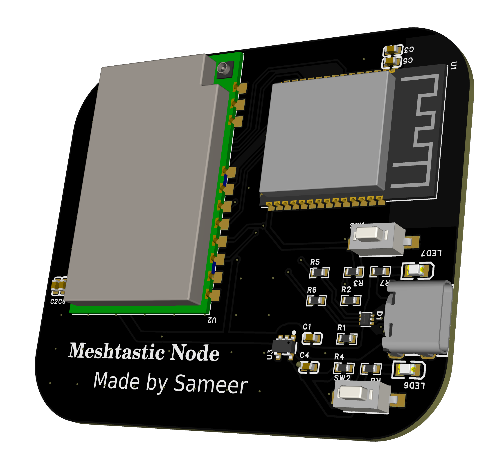
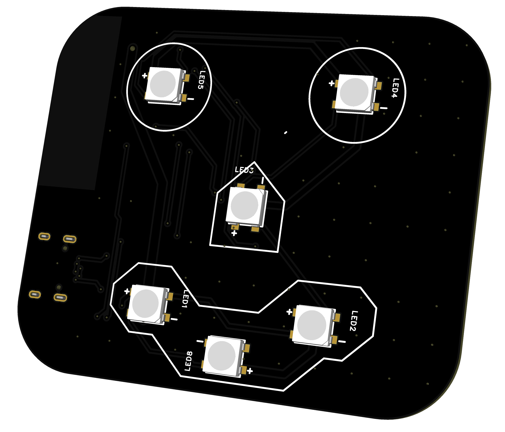
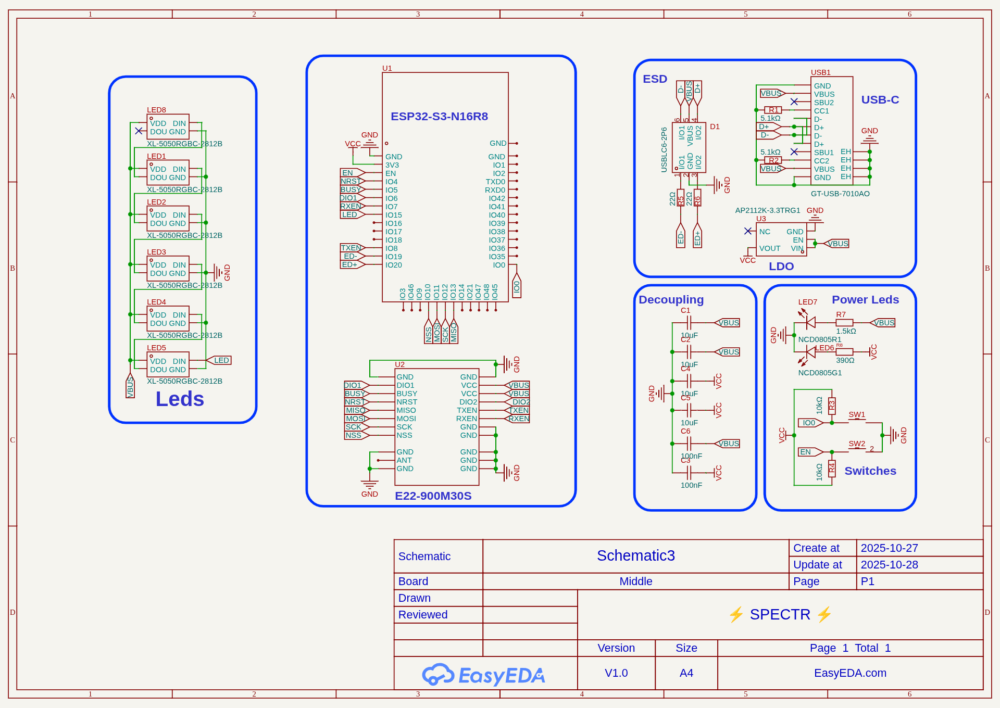

# ⚡ SPECTR ⚡
A device which can communicate wirelessly upto 12km without relaying on a grid network ,without need of any license .This device uses the 868Mhz ISM Band to communicate with the self-hosted mesh network .This device works as a Meshtastic node which makes a easy to use encrypted offgrid network.

## Usage :
This device can be used in areas with low network connectivity and in places where there is no need of using internet (Sending data between the self-hosted network).
This device can be connected to a Phone ,Laptop ,Tablet via Bluetooth or WiFi and use the Meshtastic app to send messages to the the device , which will forward the message to the mesh network and the message will be delivered to the other node which then will be visible on the app on other end.

## Working :
This device consits of different parts to form itself a piece of art ,which includes 2 PCBs(1 for the artistic purposes only) and 2 3d printed parts.
In the core of this device is an ESP32-S3-N16R8 (Most powerful and the Best MCU of the Series) and a E22-900M30S (An effecient and Powerfull LoRa Module working on 868Mhz).
The ESP32 communicates with the User to recieve commands and then sends it to E22-900M30S ,which then sends it to the other node through Lora protocol.

## Images :
**Final Product :**  

  

**PCB :** 

  
  
   
  
 

